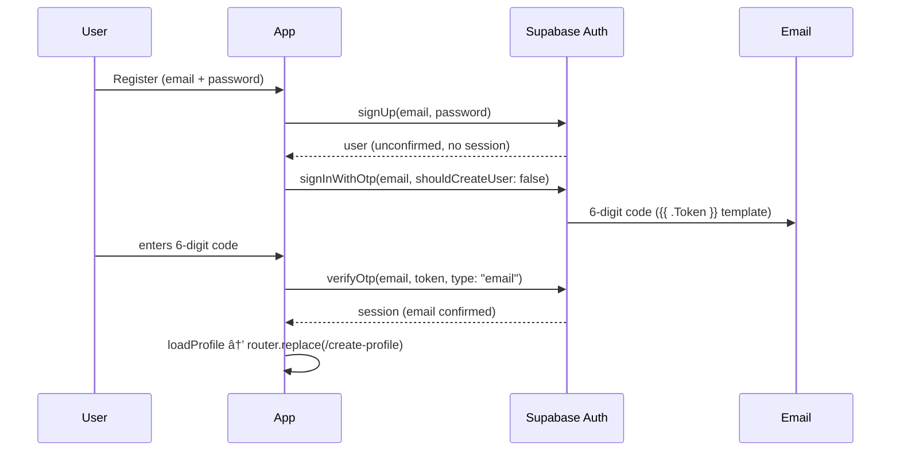
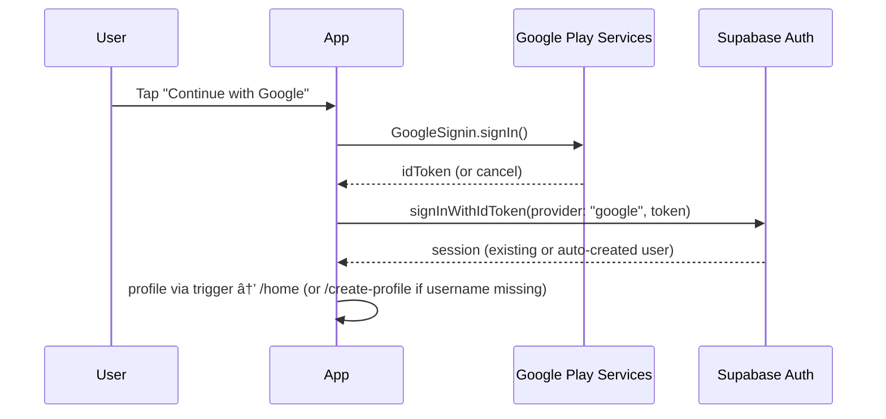

# Auth Migration Plan — OTP + Google Sign-In (Phase 10)

Status: **In progress** (implementation started after this audit)
Scope: `covia-mobile` only — **no database migrations, no RLS/RPC changes.**

---

## 1. Existing authentication architecture

### Flow today (Phase 2, email + password, PKCE)

```
Signup ──▶ signUp(email, password) ──▶ confirmation email (link) ──▶ user leaves app
   │                                       │
   │                                       ▼
   │                              covia://verify?code=… (deep link)
   │                                       │
   │                                       ▼
   └── (no session yet)          AuthContext.handleUrl ──▶ exchangeCodeForSession
                                                      │
                                                      â–¼
                                          session + email_confirmed_at
                                                      │
                                                      â–¼
                                              router.replace(/home)
```

### Where the pieces live

| Concern | Location | Notes |
| --- | --- | --- |
| Supabase client | `src/services/supabase.ts` | `flowType: "pkce"`, `detectSessionInUrl: false`, AsyncStorage persistence, `autoRefreshToken: true` |
| Session restore + events | `src/context/AuthContext.tsx` | `getSession()` on mount, `onAuthStateChange` keeps state in sync |
| Confirmation deep link | `AuthContext.handleUrl()` (line 152) | `exchangeCodeForSession(url)` for URLs containing `code=` + `verify`/`callback` |
| Reset deep link | `AuthContext.handleUrl()` | Same exchange for `reset`; sets `resetReady`/`resetError` |
| `signUp` redirect | `AuthContext.signUp()` (line 216) | `emailRedirectTo: Linking.createURL("verify", { from: "signup" })` |
| `resendVerification` | `AuthContext.resendVerification()` (line 309) | `supabase.auth.resend({ type: "signup" })` + same redirect |
| Verify screen | `app/(auth)/verify.tsx` | Waits for deep link; polls `emailVerified`; "Resend email" button |
| App gate | `app/_layout.tsx` (line 31) | `canAccessApp = status === "authenticated" && emailVerified` |
| Unverified routing | `register.tsx:98`, `login.tsx:58` | No session → `/verify` |
| Profile creation | DB trigger `handle_new_user` (`covia-backend/.../0001_profiles.sql`) | Auto-creates `profiles` row on `auth.users` insert; carries `full_name`/`phone` from `raw_user_meta_data`; client fallback `ensureProfile()` |

### PKCE / deep-link integration summary

- PKCE is the auth `flowType` for the **email-link flows** (confirm + reset). `detectSessionInUrl`
  is disabled because deep links are handled manually in `handleUrl`.
- The `covia` scheme (app.json) backs `Linking.createURL(...)`; redirect URLs
  `covia://verify` and `covia://reset` are registered in the Supabase dashboard.
- **New flows do not use deep links at all**: OTP codes are typed inside the app, and native
  Google Sign-In returns the ID token directly. Only the password-reset link flow is retained.

---

## 2. Migration steps

### A. Google Sign-In (native)

1. `npx expo install @react-native-google-signin/google-signin` — native module, **requires a new
   dev build** (`eas build --profile development --platform android`).
2. `src/services/googleAuth.ts` (new): `GoogleSignin.configure({ webClientId })`,
   `signInWithGoogle()` → `hasPlayServices()` → `signIn()` → ID token →
   `supabase.auth.signInWithIdToken({ provider: "google", token })`.
3. `AuthContext.signInWithGoogle()`: wraps the service, runs the standard session install path
   (`loadProfile` + `loadAdmin` — `onAuthStateChange` already applies the session).
4. UI: "Continue with Google" on welcome/login/register; divider separating Google from email.
5. New-user detection: `profile.username === null` → `/create-profile`; else `/home`.
6. app.json: `ios.googleSignIn.reservedClientId` (+ plist config), `android.googleServicesFile`
   (`google-services.json`), iOS `GoogleService-Info.plist`.
7. Manual dashboard work (guided): Google Cloud OAuth client IDs → Supabase
   Auth → Providers → Google (client IDs must match).

### B. Email OTP (replaces the activation link)

1. `AuthContext.sendOtp(email)` → `supabase.auth.signInWithOtp({ email, options: { shouldCreateUser: false } })`.
2. `AuthContext.verifyOtpEmail(email, token)` → `supabase.auth.verifyOtp({ email, token, type: "email" })`.
   - `type: "email"` is the current API; `signup`/`magiclink` are deprecated.
   - `shouldCreateUser: false` so OTP can't mint accounts outside the signup flow.
3. `app/(auth)/verify.tsx` rewritten as the OTP screen: 6-digit input
   (`src/components/ui/OtpInput.tsx`), auto-verify, 60s resend countdown, invalid/expired/network
   states, success animation.
4. Dashboard: "Magic Link" email template must render `{{ .Token }}` (the 6-digit code) instead of
   `{{ .ConfirmationURL }}`. OTP expiry default 1h; resend throttled server-side to 60s.
5. The old `verify` deep-link path is **retained** in `handleUrl` (harmless; still works if a stale
   link is tapped). The reset flow is unchanged.

### C. Sequence diagrams

Email OTP signup (new):



Google Sign-In (new):



---

## 3. Security considerations

- **No RLS/RPC changes.** `handle_new_user` trigger gives Google users profiles automatically;
  `ensureProfile()` remains the client-side fallback.
- **Sessions**: all three methods install a normal Supabase session — same
  `autoRefreshToken` / AsyncStorage persistence; nothing about refresh changes.
- **OTP abuse**: client 60s countdown + Supabase server-side 60s request throttle + 1h expiry +
  Supabase brute-force attempt limits on `verifyOtp`. `shouldCreateUser: false` prevents account
  creation via OTP.
- **Google**: ID token verified by Supabase against the configured Google client IDs; the app never
  handles OAuth codes. Cancellation produces no state change.
- **Existing users**: email already in use → Google identity is linked to that account (Supabase
  auto-link when the email matches a verified provider); same account, no data loss.
- Rate limiting on `signInWithPassword` (exponential backoff in `login.tsx`) is untouched.

## 4. Edge cases

| Case | Behaviour |
| --- | --- |
| OTP entered after expiry | Friendly "code expired" → resend button |
| Wrong OTP (×6) | Friendly error; retry allowed; Supabase enforces attempt caps |
| Resend tapped during countdown | Disabled until 60s elapse |
| User closes app mid-verify | OTP still valid until expiry; flow restarts from `/verify` |
| Google cancel | Silent return to previous screen, no error banner |
| Play services missing / outdated | Friendly message with retry |
| Google network failure | Friendly message with retry |
| Existing email account, first Google login | Identity linked, signs in as that account |
| Google user without username | Routed to `/create-profile` |
| Unverified password user logs in | Routed to `/verify` (OTP screen) |
| Stale confirmation link tapped | Still handled by `handleUrl`; no regression |

## 5. Regression checklist (must stay green)

- [ ] Password login with exponential backoff still works
- [ ] Reset-password deep link (`covia://reset`) still exchanges and lands on reset screen
- [ ] Session restored on relaunch; logout clears everything
- [ ] Unverified login still gated by `canAccessApp` (emailVerified)
- [ ] Existing email signup (non-OTP path removed only on the client) — no server behaviour change

---

## 6. Security review — Phase D findings (post-implementation)

Verified after implementation; no code changes were required for any item
except the two fixes listed at the end.

| # | Check | Result |
| - | ----- | ------ |
| 1 | **Sessions refresh correctly** | ✅ `src/services/supabase.ts` untouched — `autoRefreshToken: true`, AsyncStorage persistence, PKCE flowType. All new methods (`signInWithIdToken`, `verifyOtp`) install sessions through the same client/refresh path. |
| 2 | **Google users get profile creation** | ✅ `handle_new_user` trigger (migration 0001) fires on `auth.users` insert and carries Google's `full_name`; `ensureProfile()` remains the client fallback; avatar copied from Google metadata on first sign-in (non-fatal on failure). |
| 3 | **OTP cannot be abused** | ✅ `shouldCreateUser: false` (OTP never mints accounts); Supabase server-side 60 s request throttle + 1 h expiry + `verifyOtp` attempt caps; client 60 s resend countdown. |
| 4 | **Rate limiting still works** | ✅ Password-login exponential backoff in `login.tsx` untouched. |
| 5 | **RLS unchanged** | ✅ Zero DB migrations/grants/policies touched (verified via `git log --name-only` for the phase). |
| 6 | **Existing RPCs continue working** | ✅ None modified. |

### Edge-case fixes applied during QA

1. **`email_not_confirmed` login error** — a login with an unverified email
   now routes the user to the OTP screen (with the email forwarded) instead
   of showing a dead-end error message (`app/(auth)/login.tsx`).
2. **Phantom resend countdown** — if the OTP email fails to send (e.g.
   server rate limit), the 60 s countdown resets so the user can retry
   immediately (`app/(auth)/verify.tsx`).
3. Outdated "confirmation link" copy on the `email_not_confirmed` mapping
   updated to "verification code" (`src/services/authErrors.ts`).

---

## Post-verification onboarding state machine (Phase 11)

The onboarding lifecycle is persisted on `profiles` (migration 0044)
so reinstalls and app restarts can never bypass or skip a step:

| Step        | Route              | What the user sees                       |
| ----------- | ------------------ | ---------------------------------------- |
| `onboard` | `/(flow)/onboard`          | Post-verification welcome screens      |
| `profile` | `/(flow)/create-profile`   | Profile setup (name, photo, details)   |
| `verify`  | `/(flow)/verification`     | Identity verification intro + uploads  |
| `complete`| `/(tabs)/home`             | Normal app                              |

### How it works

* `profiles.onboarding_step` (default `onboard`) +
  `profiles.onboarding_completed`; existing rows backfilled to
  `complete` by the migration so current users stay in the app.
* `AuthContext` exposes `onboardingStep` / `onboardingCompleted` /
  `stepReady` / `setOnboardingStep`; the profile is loaded before any
  auth entry point resolves, so post-auth redirects are race-free.
* `src/lib/onboarding.ts` — `homeRouteForStep(step)` is the ONLY
  way screens compute post-auth destinations (no hardcoded `/home`).
* Root `Stack` is a three-way guard: main app groups
  (`(tabs)`/`(app)`/`admin`) only when `complete`; `(flow)`
  only while mid-setup; `(auth)` as the fallback.
* Verification flow mode (`?from=flow`) shows the intro card and the
  "I'll verify later" / "Go to home" escape hatches, which advance the
  step to `complete`.

### Resume behaviour

Sign out, kill the app, or reinstall at any point: the next launch
lands on `homeRouteForStep(profile.onboardingStep)` — exactly where
the user left off.
